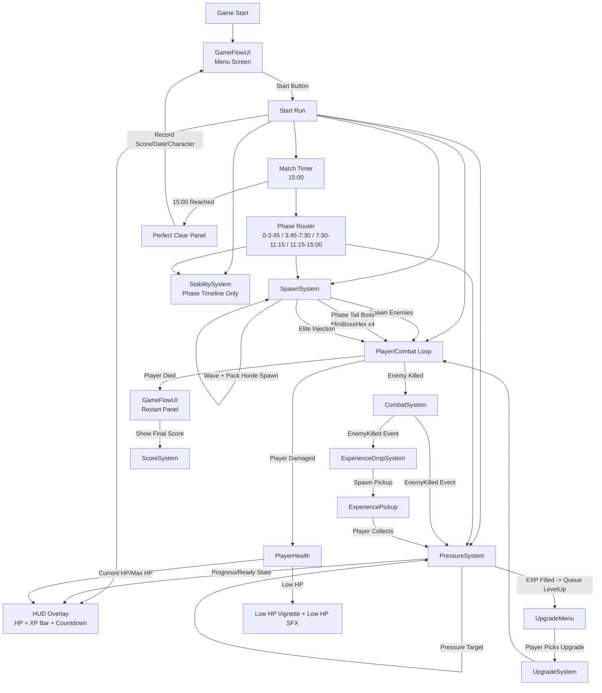

# System Flow Diagram

```mermaid
flowchart TD
    A[Game Start] --> B[GameFlowUI\nMenu Screen]
    B -->|Start Button| C[Start Run]
    C --> C1[Match Timer\n15:00]
    C1 --> C2[Phase Router\n0-3:45 / 3:45-7:30 / 7:30-11:15 / 11:15-15:00]
    C --> D[SpawnSystem]
    C --> E[PressureSystem]
    C --> N[StabilitySystem\nPhase Timeline Only]
    C --> F[Player/Combat Loop]
    C --> U[HUD Overlay\nHP + XP Bar + Countdown]

    C2 --> D
    C2 --> E
    C2 --> N
    D -->|Spawn Enemies| F
    E -->|Pressure Target| E
    F -->|Enemy Killed| G[CombatSystem]
    G -->|EnemyKilled Event| E
    G -->|EnemyKilled Event| X[ExperienceDropSystem]
    X -->|Spawn Pickup| Y[ExperiencePickup]
    Y -->|Player Collects| E

    E -->|EXP Filled -> Queue LevelUp| H[UpgradeMenu]
    H -->|Player Picks Upgrade| I[UpgradeSystem]
    I --> F
    E -->|Progress/Ready State| U
    J -->|Current HP/Max HP| U

    F -->|Player Damaged| J[PlayerHealth]
    J -->|Low HP| K[Low HP Vignette + Low HP SFX]

    F -->|Player Died| L[GameFlowUI\nRestart Panel]
    L -->|Show Final Score| M[ScoreSystem]

    D -->|Phase Tail Boss\nMiniBossHex x4| F
    D -->|Wave + Pack Horde Spawn| D
    D -->|Elite Injection| F

    C1 -->|15:00 Reached| R[Perfect Clear Panel]
    R -->|Record Score/Date/Character| B
```
