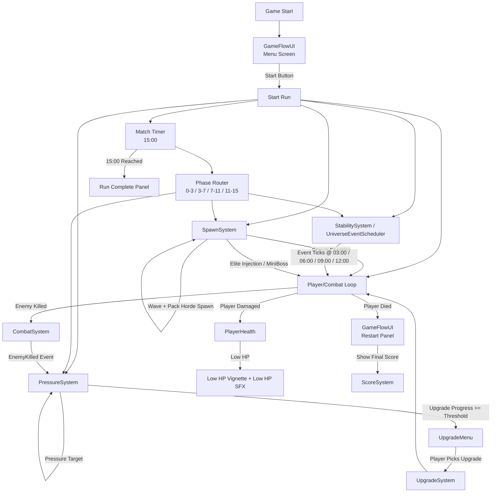

# System Flow Diagram

```mermaid
flowchart TD
    A[Game Start] --> B[GameFlowUI\nMenu Screen]
    B -->|Start Button| C[Start Run]
    C --> C1[Match Timer\n15:00]
    C1 --> C2[Phase Router\n0-3 / 3-7 / 7-11 / 11-15]
    C --> D[SpawnSystem]
    C --> E[PressureSystem]
    C --> N[StabilitySystem / UniverseEventScheduler]
    C --> F[Player/Combat Loop]

    C2 --> D
    C2 --> E
    C2 --> N
    D -->|Spawn Enemies| F
    E -->|Pressure Target| E
    F -->|Enemy Killed| G[CombatSystem]
    G -->|EnemyKilled Event| E

    E -->|Upgrade Progress >= Threshold| H[UpgradeMenu]
    H -->|Player Picks Upgrade| I[UpgradeSystem]
    I --> F

    F -->|Player Damaged| J[PlayerHealth]
    J -->|Low HP| K[Low HP Vignette + Low HP SFX]

    F -->|Player Died| L[GameFlowUI\nRestart Panel]
    L -->|Show Final Score| M[ScoreSystem]

    N -->|Event Ticks @ 03:00 / 06:00 / 09:00 / 12:00| F
    D -->|Wave + Pack Horde Spawn| D
    D -->|Elite Injection / MiniBoss| F

    C1 -->|15:00 Reached| R[Run Complete Panel]
```
