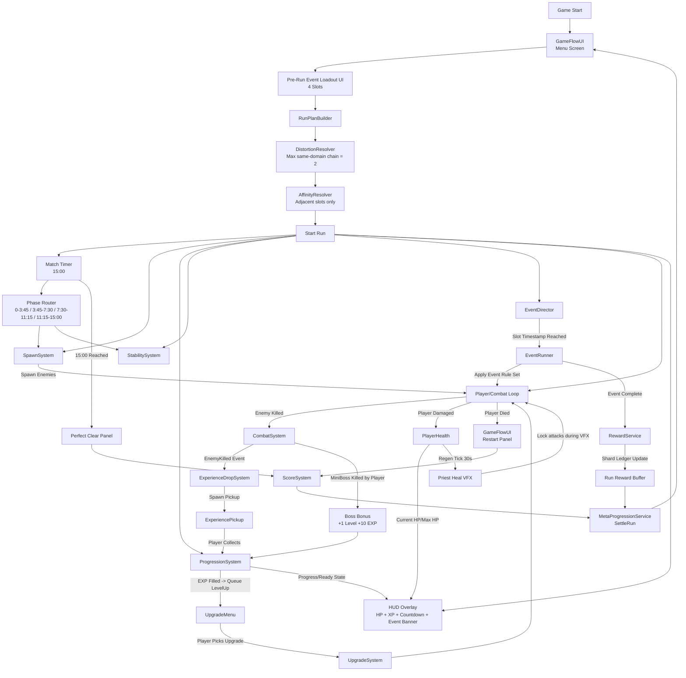

# System Flow Diagram
Last Synced: 2026-03-01

## Runtime Notes
- Event scheduling:
  - run plan is fixed pre-run; no mid-run random event picks.
  - distortion and affinity are precomputed from adjacent slot sequence.
- Time intensity rule:
  - "pressure" is game-time intensity.
  - balancing should use timestamps, durations, and tier time profiles.
- Spawn pacing sync:
  - catch-up uses `HordeTargetAliveRatio = 0.82` and `HordeCatchUpBudgetFactor = 0.22`.
  - Tier1 pacing row uses `spawn_interval 1.70~2.35`, `max_alive = 24`.
- Boss bonus sync:
  - defeating a miniboss grants immediate progression bonus (`+1` level and `+10` EXP, temporary tuning).
- EventRunner execution sync:
  - active slot effects are consumed by player/enemy movement and projectile loops each physics tick.
  - Blood Tide can enqueue directional rush packs through `SpawnSystem.EventSpawnDirectionalRush(...)`.
- Reward settlement sync:
  - completed slot rewards are buffered by director-owned `RewardService`.
  - end-state settlement passes `RunResult.DomainShardRewardsByDomain` into `MetaProgressionService.SettleRun(...)`.
- HUD HP rendering:
  - in-run HP is numeric only (`HP x/y`), segment blocks are removed.
